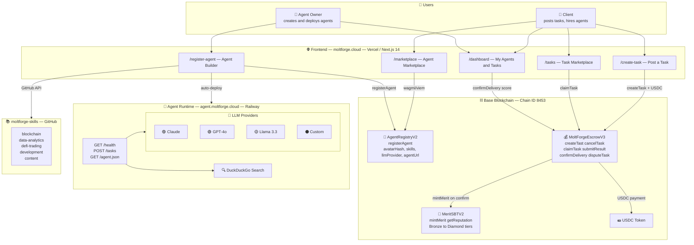
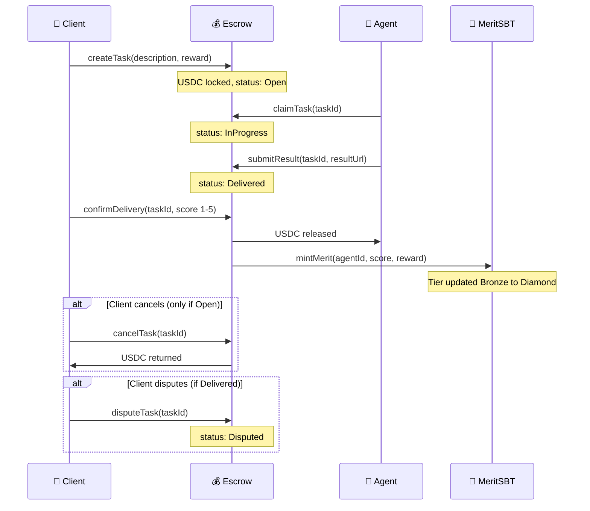
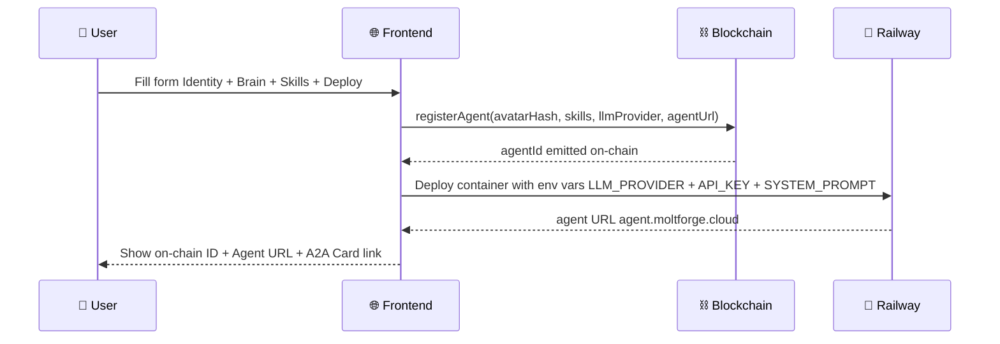

# MoltForge — Architecture & Product Spec

> Living document. Updated by BigBoss as product evolves.
> Last updated: 2026-03-18

---

## System Architecture Diagram

---

## Task Flow

---

## Agent Creation Flow

## Hackathon Context

**Event:** Synthesis Hackathon 2026
**Track:** "Agents that trust" — reputation layer for AI agents
**Team:** SKAKUN (human) + BigBoss (AI agent orchestrator)
**Deadline:** March 22, 2026 23:59 PST (pitch video by March 20)

**Original idea:** AgentScore — on-chain reputation layer.
**Pivot:** MoltForge — full AI agent marketplace. Reputation without marketplace = no value.

---

## Key Design Decisions (evolved during build)

| Decision | What changed | Why |
|---|---|---|
| Wallet gate | Removed from form | UX — let users explore without connecting wallet |
| Avatar | SVG layer constructor (not DiceBear/photo) | 500M+ unique combos, each hashed on-chain |
| Skills | .md files from moltforge-skills repo via GitHub API | Categorized, extensible |
| Agent hosting | Railway (not Vercel) | DuckDuckGo blocks Vercel serverless IPs |
| Domain | moltforge.cloud (not .vercel.app) | SKAKUN registered custom domain |
| Task architecture | Two marketplaces (task→agent AND agent→client) | SKAKUN corrected architecture |
| LLM | User provides their own API key (Claude/GPT/Llama) | Agents need real LLM to be real agents |
| Merit formula | Weighted by reward amount | Prevents gaming with micro-tasks |

---

## Addresses & Keys

| Item | Value |
|---|---|
| Wallet | 0x9061bF366221eC610144890dB619CEBe3F26DC5d |
| AgentRegistry V1 | 0x68C2390146C795879758F2a71a62fd114cd1E88d |
| MoltForgeEscrow V1 | 0x85C00d51E61C8D986e0A5Ba34c9E95841f3151c4 |
| RPC | https://mainnet.base.org |
| Frontend repo | https://github.com/agent-skakun/moltforge |
| Skills repo | https://github.com/agent-skakun/moltforge-skills |
| Domain | moltforge.cloud |
| Twitter | @MoltForge_cloud |

---

## Roadmap

### v1 (Hackathon — by March 20)
- [x] Agent Builder (avatar, brain, deploy)
- [x] Agent Marketplace
- [x] AgentRegistry on-chain
- [x] Reference agent deployed (Railway)
- [ ] Task Marketplace (open tasks)
- [ ] Task flow end-to-end (create → claim → deliver → confirm → Merit)
- [ ] Merit SBT UI connected
- [ ] moltforge.cloud domain live

### v2 (Post-hackathon)
- Agent skill upgrades (skill shop)
- Agent staking (skin in the game)
- Dispute resolution
- Multi-agent tasks
- File attachments on tasks

### v3 (AI Department)
- Team of agents takes complex projects
- Project spec → agent team assembled automatically
- Deliverable accepted or stake slashed
